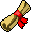
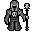
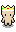
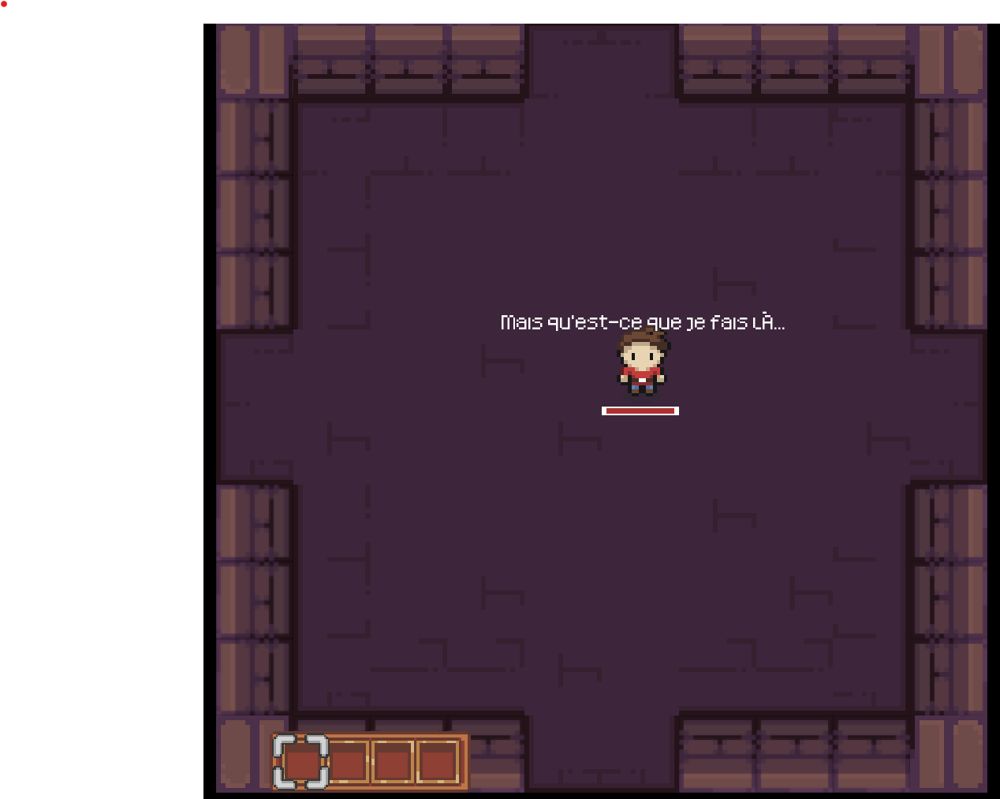
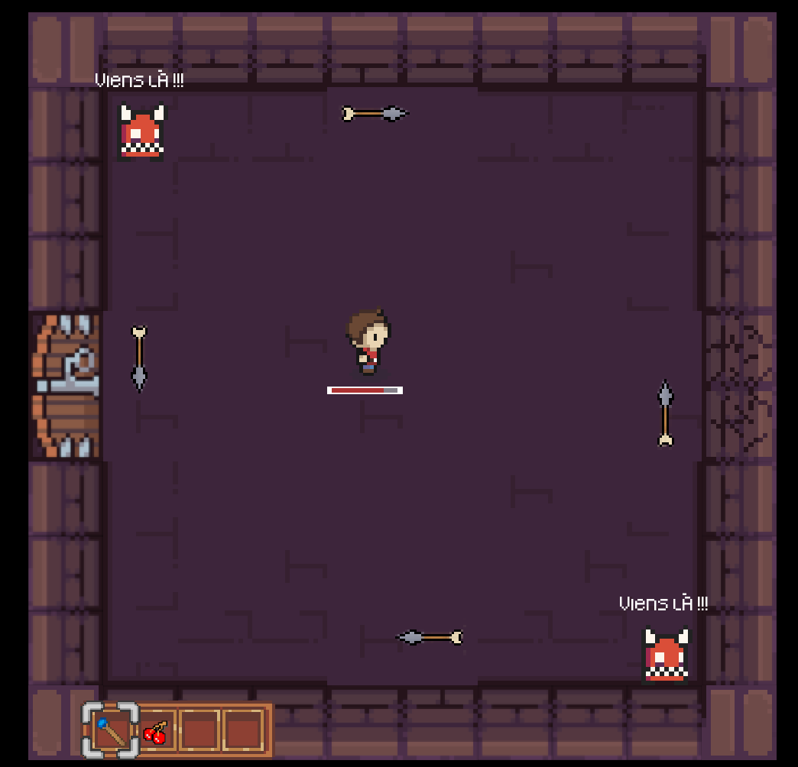
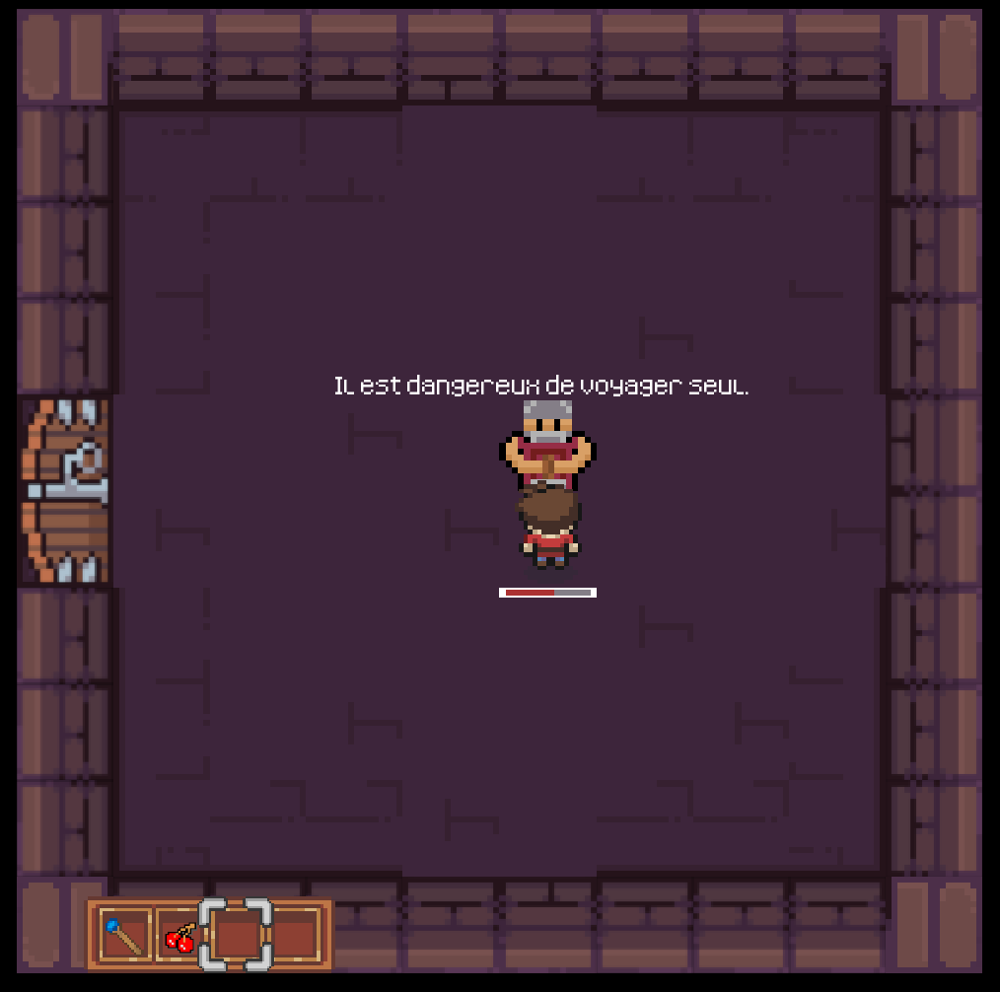
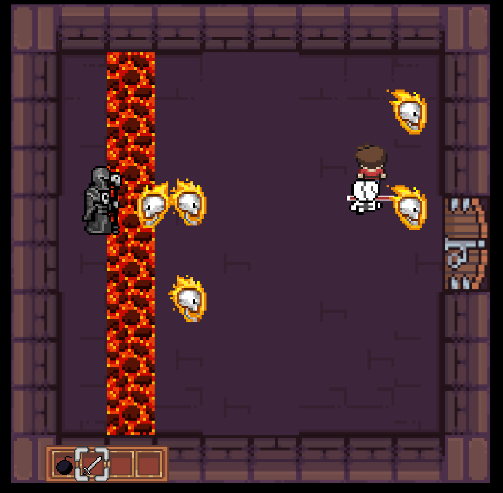
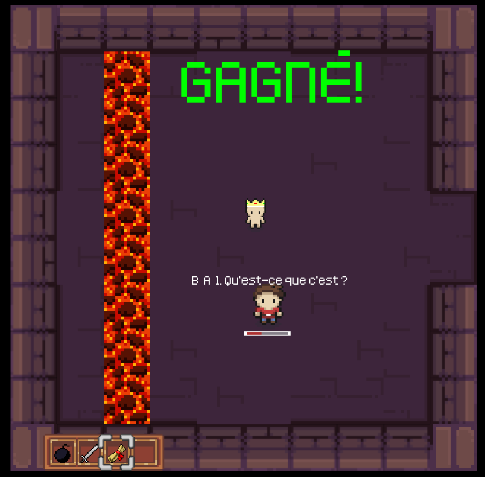

# Extensions principales
- Ajout de nouveaux items (tels que la bombe ou l'épée)
- Ajout de nouveaux types de salles (telle que la forgeronRoom)
- Ajout d'un système d'inventaire
- Ajout d'une barre de vie
- Ajout d'un combat de boss
- Ajout d'animations sur à peu près tout
- Ajout de dialogues
- Ajout de nouveaux monstres
- Ajout d'un type de connector
- Ajout de cases de lave
- Ajout de l'invincibilité
- Ajout d'une barre de vie

# Table des matières des classes principales liées aux extensions
- [Lié aux items](#items) :
  - [Utilisation des Items](#utilisation-dun-item)
    - [Algorithme d'utilisation d'un Item](#algorithme-dappel-de-la-fonction-useitem)
    - [Utilisation d'un Item en passant l'orientation](#utilisation-dun-item-en-passant-lorientation)
  - [Bomb](#bomb)
  - [Sword](#sword)
  - [Diplôme](#diplôme)
  - [Inventory](#inventory)
  - [ItemUseListener (interface)](#itemuselistener)
- [Lié aux VFX](#vfx) :
  - [Explosion](#explosion)
    - [Affichage](#affichage)
    - [Interactions](#collisions)
  - [Animations](#animations)
    - [Stockage](#stockage)
    - [Update et Draw](#update-et-draw)
- [Lié aux salles](#rooms) :
  - [Level0BombRoom](#level0bombroom)
  - [Level0SkeletonRoom](#level0skeletonroom)
  - [Level0SwordRoom](#level0swordroom)
  - [Level0ForgeronRoom](#level0forgeronroom)
  - [Level0BossRoom](#level0bossroom)
  - [ConnectorType.CRACKED](#connectors)
- [Lié aux ennemis](#ennemis) :
  - [FireBallDarkLord](#fireballdarklord)
  - [DarkLord](#darklord)
  - [Skeleton](#skeleton)
- [Lié aux dialogues](#dialogues) :
  - [SpeakerActor](#speakeractor)
  - [Dialog](#dialog)
- [Lié au type de sol](#types-de-sol) :
  - [Lava](#lava)
- [Lié aux personnages](#personnages) :
  - [Invincibilité](#invincibilité)
  - [Barre de vie](#barre-de-vie)
  - [King](#king)
  - [Forgeron](#forgeron)
- [Images du jeu](#images-du-jeu)
# Explications
Vous trouverez dans cette section tous les éléments nécessaires à la compréhension des classes.
## Items
### Utilisation d'un Item
#### Algorithme d'appel de la fonction `useItem`
L'utilisation d'un item fonctionne approximativement de la même manière que les interactions, c'est-à-dire :
1. Le `ICRoguePlayer` appelle la méthode `useCurrentItem` de son inventaire.
2. L'inventaire appelle la méthode `tryToUseItem` de l'item en cours si il y en a un (c.à.d celui qui est sélectionné par le curseur).
3. La méthode `tryToUseItem` va appeler la méthode `canUseItem` de l'implémentation de `itemUseListener` dans `ICRoguePlayer` 
(`ItemHandler`) en se passant soi-même en argument. (Le `ItemHandler` lui a été passé en argument au moment où l'objet a été ramassé).
4. La méthode `canUseItem` peut ainsi gérer séparément les cas d'utilisation des différents `Item` sans passer par des tests de type tout en étant à l'intérieur de `ICRoguePlayer`
5. De manière générale, si l'`Item` a besoin d'interagir à nouveau sur la carte, sa fonction `useItem` est ainsi appelée en passant en
paramètres l'aire courante et la position d'apparition pour pouvoir l'enregistrer à nouveau, bien qu'il ait un comportement
tout à fait différent.

L'implémentation de ce mode de fonctionnement permet d'éviter les tests de type tout en ne sachant pas à l'avance quel item
est utilisé. Cela permet ainsi de pouvoir upscale le nombre d'objets utilisables assez facilement tout en préservant une bonne
encapsulation.
#### Utilisation d'un `Item` en passant l'orientation
En plus de l'utilisation d'un `Item` avec la touche **X**, il est possible d'utiliser les items en passant l'orientation voulue
en utilisant les flèches directionelles. En faisant ainsi, l'attribut `orientationAiming` de `ICRoguePlayer` ne vaut plus `null` et permet ainsi
de continuer à se déplacer avec la bonne orientation tout en utilisant une autre orientation pour tout le reste (interactions,
utilisation d'un `Item`).
### ItemUseListener
Cette interface permet de ne pas forcément avoir à réimplémenter toutes les méthodes de `useItem` prenant en paramètre les 
différents `Item` pour un certain utilisateur d'`Item`, mais seulement celles nécessaires. Elle joue le même rôle que `ICRogueInteractionHandler` mais pour l'utilisation
d'un `Item`.\
Une seule implémentation de cette interface est faite dans une nested class de `ICRoguePlayer` qui se nomme `ItemHandler`.
### Inventory 
L'inventaire est une classe dont une instance est stockée comme un attribut de player. Il permet de stocker jusqu'à
4 objets de type `Item`. Le `ICRoguePlayer` appelle lui-même le `draw` et `update` de l'inventaire depuis sa méthode`draw` et `update`.\
Quand on rajoute un objet dans l'inventaire ou quand on en enlève un, l'image de l'inventaire est redéfinie selon la méthode `updateSprite`.

### Bomb
| `Bomb`   |                                   |
|----------|----------------------------------------------------------------------------------------------------|
| Dégâts   | 1 (2 au boss)                                                                                      |
| Action() | Explose et met des dégâts (permet aussi de détruire les connectors de type [Cracked](#connectors)) |

La bombe est un objet ramassable en passant dessus qui se met dans l'inventaire. Lorsqu'elle est posée, la mèche se met à brûler
et lorsque l'animation arrive à la fin elle crée des `Explosion` dans les 4 cases autour d'elle et celle du milieu.
En tant qu'Interactor, elle interagit donc sur les entités "vivantes" (`ICRoguePlayer`, `Turret` ...) en leur infligeant 1 dégât,
mais interagit aussi sur les `Connector` de type `ConnectorType.CRACKED` en les transformant en `ConnectorType.OPEN`.
### Sword

| `Sword`   |                                                                    |
|-----------|------------------------------------------------------------------------------------------------------------------------------------|
| Dégâts    | 1                                                                                                                                  |
| Action(s) | Inflige un dégât aux entités présentes devant la case du joueur, permet aussi de renvoyer les boules de feu du boss et les flèches |

L'épée est un `Item` ramassable à distance (comme le `Staff`) qui se met dans l'inventaire. Lorsque l'objet est utilisé,
il est à nouveau enregistré sur la case de devant et interagit avec les `Interactable` qui passent sur cette case.\
L'épée permet de tuer les `Skeleton` et les `Turret` ainsi que de renvoyer les `Arrow` et les `FireBallDarkLord` selon
l'orientation de l'épée au moment de l'interaction. Cela permet ainsi de tuer les `Turret` avec leurs propres flèches
et de tuer le `DarkLord` avec ses propres boules de feu (ce qui est par ailleurs le seul moyen de le battre comme il est immunisé aux `FireBall`du `ICRoguePlayer`).

### Diplôme
| `Diplom` |  |
|----------|----------------------------------------------------------------|
| Titre    | BA 1                                                           |

Le `Diplom` est un `Item` ramassable en passant par-dessus. Cet item sert à montrer que vous avez battu le boss et porte le nom
de BA1. Malheureusement le joueur n'a aucune idée de ce que c'est... ;)
## VFX
### Explosion
Dans notre jeu, les explosions sont des éléments qui impliquent 2 choses principales :
- leur affichage
- les interactions
#### Affichage
Pour afficher les explosions, il existe une classe `Explosion` dans le package `game.icrogue.visualEffects` qui étend `ICRogueActor`. 
Lorsqu'elle est instanciée, elle affiche juste un sprite d'explosion avec une animation à une case donnée. Cette classe est immuable, 
et ne fait rien de plus.

#### Collisions
C'est bien d'avoir une explosion, et même si le mieux est l'ennemi du bien, il est plus utile que ces explosions puissent interagir
avec des éléments. Cependant, voulant éviter d'avoir des interactions entre une explosion est un élément similaire, quelle que soit la source de l'explosion,
les interactions qui lui sont liées sont en réalité gérées par l'émetteur de l'explosion, pour faire cela, on change la méthode 
`getFieldOfViewCells()` en lui ajoutant les cases où des explosions sont affichées, de cette manière, c'est l'objet qui explose qui
interagit lorsqu'il explose.
### Animations
La plupart des sprites sont animés. Cela est fait grâce à la classe `Animation` et la classe `Sprite` et leurs méthodes `createAnimations`
 et `Sprite.extractSprite` qui permettent d'extraire les images des fichiers et en créer des animations. 
#### Stockage
Les animations sont stockées soit en `Animation[]` soit en `Animation` selon si l'animation est différente selon l'orientation ou non.
#### Update et Draw
Les fonctions `update` et `draw` sont directement implémentées dans la classe `Animation`, nous n'avons donc qu'à les appeler depuis 
les méthodes `update` et `draw` du `ICRogueActor` correspondant.
## Rooms
Les salles sont des éléments centraux au gameplay d'un jeu de type "rogue like", car elles composent l'environnement dans lequel le joueur va évoluer.
Afin de varier un peu les salles, nous avons implémenté 5 nouvelles salles différentes qui ont chacune leurs particularités. Toutes ces salles sont générées par des 
classes situées dans le package `game.icrogue.area.Level0`

### Level0BombRoom 
La "Bomb room" est gérée par la class `Level0BombRoom` qui étend la classe `Level0ItemRoom`, 
en ajoutant simplement une bombe à la salle. Le "challenge" de la salle est terminée lorsque ladite bombe est récupérée par le joueur. Cette salle permet d'assurer que le joueur ai eu au moins une fois l'occasion de récupérer
une bombe pour ouvrir le [`ConnectorType.CRACKED`](#connectors). Une bombe est rajoutée à chaque fois que le joueur entre dans la salle
afin que le joueur ne soit pas bloqué car il en a besoin pour ouvrir le [`ConnectorType.CRACKED`](#connectors) ce qui est essentiel 
pour finir le niveau. (S'il avait utilisé la bombe sans ouvrir le connector cela l'empêcherait d'accéder ainsi à la salle du forgeron)
### Level0SkeletonRoom
La "Skeleton room" est gérée par la classe `Level0SkeletonRoom` qui étend `Level0EnemyRoom`. Cette salle génère un [`Skeleton`](#skeleton), lorsqu'il est mort, le défi de la salle est complété.
### Level0SwordRoom
La "Sword room" est gérée par la classe `Level0SwordRoom` qui étend `Level0ItemRoom`. Cette salle ajoute simplement une épée que le joueur peut récupérer.
### Level0ForgeronRoom
La "Forgeron room" est gérée par la classe `Level0ForgeronRoom` qui étend `Level0Room`. Cette salle contient le [`Forgeron`](#forgeron) et redéfinit la méthode `challengeCompleted()` en définissant que c'est lorsque le Forgeron a
fini son dialogue que le challenge est complété
### Level0BossRoom
La "Boss room" est gérée par la classe `Level0BossRoom` qui étend `Level0Room`. Cette salle contient le [`DarkLord`](#darklord), 
le boss qu'il faudra combattre et génère aussi un mur de [`Lava`](#lava) qui bloque l'accès au boss.
Dans cette sous-classe, 2 nouvelles méthodes sont crées, `setSpawnCoordinates()` et `setRoomOrientation()`, la première 
définie à quelle position le boss doit spawn et la deuxième définit de quel côté de la salle on fait spawn le boss et le mur de [`Lava`](#lava). Ces 2 méthodes permettent 
de positionner le boss correctement par rapport au seul connecteur qui mène à lui (la génération de map s'assure de ne pas assigner plusieurs connecteurs qui mène vers le boss)
On fait ces fonctions afin d'éviter que le joueur en entrant dans une salle se retrouve directement à côté du [`DarkLord`](#darklord)
### Connectors
| `ConnectorType.CRACKED` |  |
|-------------------------|--------------------------------------------------------------------------|
| Action(s) spéciale(s)   | Peut être détruit avec une bombe                                         |

Afin de pouvoir faire une salle cachée qui nécessite une bombe pour ouvrir son connecteur, nous avons ajouté le type `ConnectorType.CRACKED`

## Ennemis
Afin de rajouter un peu plus de difficultés et de varier le gameplay, nous avons rajouté un type d'ennemi ainsi qu'un boss
qui permet de finir le niveau.
### DarkLord
| `DarkLord` |  |
|------------|---------------------------------------------------------------------------------------|
| Vie        | 7                                                                                     |
| Action     | Lance 2 `FireBallDarkLord` chaque intervalle de temps régulier                        |

Le `DarkLord` correspond au Boss du niveau 0. Lors de la création du connecteur lié à sa salle, l'orientation de sa salle lui est donnée
afin de pouvoir déterminer son comportement de manière générale. Il est toujours situé de l'autre côté de l'entrée et se déplace sur tout le fond de la salle.
#### Déplacements
Le `DarkLord` se déplace de manière aléatoire entre les deux directions qui lui sont proposées, mais plus il est au bord, 
plus les probabilités qu'il se déplace vers le centre sont élevées (les probabilités augmentent linéairement selon sa position).
#### Tirs
Chaque certain temps, le `DarkLord` tire deux `FireBallDarkLord` aux deux cases autour de lui (p.ex. la case au-dessus et celle au-dessous s'il se déplace de haut en bas).\
#### Dégâts
Le `DarkLord` est insensible à presque toutes les magies. Il prend 1 dégât de ses propres projectiles s'ils lui sont renvoyés dessus et
2 dégâts de la bombe. Il ne prend aucun dégât du reste.\
De plus, il clignote un petit moment lorsqu'il prend un dégat.
#### Mort
À sa mort, un `King` apparaît au milieu de la salle.
### FireBallDarkLord
| `FireBallDarkLord`    |  |
|-----------------------|----------------------------------------------------------------------------------------|
| Dégâts                | 1                                                                                      |
| Actions               | Va dans une direction qui peut être modifié par l'interaction avec une épée            |
| Action(s) spéciale(s) | A une chance de faire spawn un `Skeleton` si elle fonce contre un mur                  |

La `FireBallDarkLord` est créée par le `DarkLord` chaque intervalle régulier de temps. Si une `Sword` interagit sur l'entité,

Lorsqu'elle touche le `ICRoguePlayer` ou un `ICRogueCellType.WALL` ou un `ICRogueCellType.HOLE`, elle crée une explosion
et inflige 1 dégât aux entités présentes dans la case.\
De plus, si l'interaction était sur un mur ou un connecteur, elle a une probabilité de faire spawn un [`Skeleton`](#skeleton)

### Skeleton

| `Skeleton` |  |
|------------|----------------------------------------------------------------------------|
| Dégâts     | 1                                                                          |
| Vie        | 1                                                                          |
| Action(s)  | Court vers le joueur et lui fait un dégât avant de mourir                  |

#### Déplacements
Afin de récupérer la position du joueur à chaque image, le squelette a un `getFieldOfViewCells` qui correspond à une magnifique
vision à 360 degrés en regardant toutes les cases de la salle. Ainsi, lorsqu'il interagit avec le joueur à distance (c.à.d qu'il le "voit"),
il peut récupérer sa position et ainsi choisir son mouvement en fonction. Cela permet d'éviter un getter intrusif.\
Le `Skeleton` avance toujours dans la direction de la position trouvée. Pour savoir s'il va d'abord effectuer un mouvement sur 
l'axe x ou sur l'axe y, la probabilité qu'il se déplace sur x est définie comme : P(x) = (dx) / (dx+dy). (P(y) définie analoguement)

## Dialogues
Les dialogues sont rajoutés afin de donner des tips sur le niveau au joueur et de faire parler les pnj. Par exemple, lorsque
le ICRoguePlayer interagit avec une porte fermée à clef, le personnage dit : "On dirait qu'il me manque une clé" ce qui permet
au joueur de comprendre ce qu'il doit faire.
### Dialog
La classe Dialog correspond à un texte de dialogue positionné par rapport à un SpeakerActor. Elle peut être affichée d'un coup en
entier ou lettre par lettre selon les besoins.
### SpeakerActor
La classe `SpeakerActor` est une extension d'un ICRogueActor en rajoutant une méthode `speak` qui permet de rajouter un dialogue
au personnage. Le dialogue stocké est de type `Dialog`. Le dialogue s'affiche toujours en blanc au-dessus du `SpeakerActor`.
## Personnages
Afin de dynamiser un peu le gameplay, nous avons ajouté vendu 2 personnages. Le [`Forgeron`](#forgeron) et le [`King`](#king).
Les classes qui gèrent les différents personnages se trouvent toutes dans le package `game.icrogue.actor.characters`-

### Forgeron
Il est géré par la classe `Forgeron` qui étend [`SpeakergActor`](#speakeractor). Le forgeron est caché dans la [`Level0ForgeronRoom`](#level0forgeronroom), une fois arrivé dans cette salle,
le joueur doit lui parler et le forgeron lui donnera la clé vers le boss. A ce même moment, les portes de la salle se débloqueront. Cette classe contient quelques nouvelles méthodes tel que:
- `resetDialog()`
- `upadteText()`
- `getFinishedTalking()`
ces 3 méthodes permettent assez explicitement d'opérer des actions liées aux dialogues 
### King
| `King`    |  |
|-----------|-------------------------------------------------------------------|
| Vie       | éternelle, LONG VIE AU ROI                                        |
| Action(s) | Donne un diplôme au joueur                                        |

Il est géré par la classe `King` qui étend [`SpeakerActor`](#speakeractor). Le king spawn dans la [`Level0BossRoom`](#level0bossroom) lorsque le boss est mort pour récompenser le joueur en lui donnant 
un [`Diplome`](#diplôme).
### Invincibilité 
Afin de rendre l'expérience du joueur meilleure, nous avons rajouté une période d'invisibilité après qu'il ait subi des dégâts.
Cela est montré par un clignotement du joueur durant un court laps de temps après avoir subi des dégâts. Durant ce laps de temps,
il ne peut prendre aucun dégât.

### Barre de vie
Le `ICRoguePlayer` possède en plus une barre de vie attachée à lui qui sert à indiquer combien de vie il lui reste de manière graphique
sans que cela soit trop austère. Comme le joueur a au maximum 5 PV, il y a 5 sprites de barres de vie qui correspondent à l'image 
de la barre de vie qui doit être affichée selon le nombre de PV.

## Types de sol
De la lave a été ajouté afin que le joueur ne puisse pas marcher jusqu'au boss durant le combat final.
### Lava
La `Lava` est un ICRogueActor qui retourne `true` à `takesCellSpace` afin que le joueur ne puisse jamais passer dessus.

## Images du jeu
| Screenshots                       |                                                                                                       |
|-----------------------------------|-------------------------------------------------------------------------------------------------------|
| Spawn                             |                                 |
| Tourelle et ConnectorType.CRACKED |  |
| Salle du forgeron                 |                  |
| Boss Room                         |                              |
| Image de victoire                 |                         |
